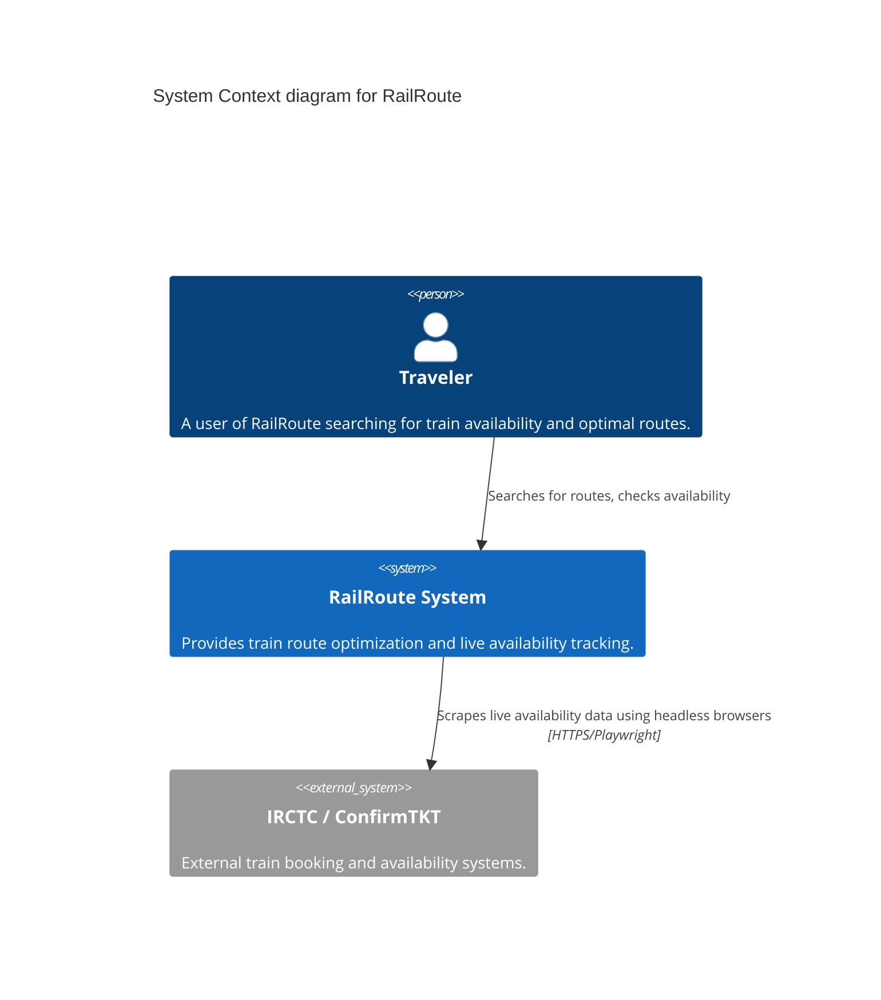
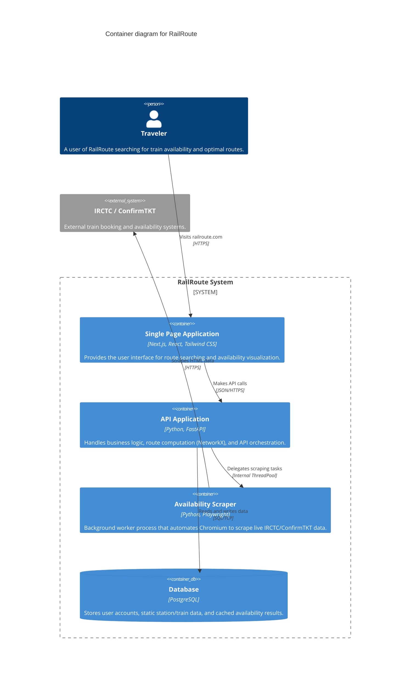

# RailRoute Architecture (C4 Model)

This document describes the software architecture of RailRoute using the C4 model for visualizing software architecture.

## Level 1: System Context Diagram

The System Context diagram provides a high-level view of RailRoute and its interactions with users and external systems.

## Level 2: Container Diagram

The Container diagram zooms into the RailRoute System to show the high-level technical containers that make up the system.

## Component Architecture (Backend)

The FastAPI backend follows Clean Architecture and Domain-Driven Design principles:

- **Routes (`app/api/v1/routes`)**: Handles HTTP requests, input validation, and HTTP responses.
- **Services (`app/services`)**: Contains the core business logic (e.g., `RouteService` building queries, `StationService`).
- **Repositories (`app/repositories`)**: Abstracts data access. Uses Dependency Inversion to allow swapping out implementations (e.g., `PgRailRepository`).
- **Core (`app/core`)**: Cross-cutting concerns, configuration, and singletons (like the in-memory `NetworkX` graph).
- **Scraper (`automation/scraper`)**: A strictly decoupled module responsible purely for data acquisition via Playwright.

## Architectural Decisions

> [!NOTE]
> **Scraper Decoupling**: The scraper uses Playwright but executes in a `ThreadPoolExecutor` using a dedicated `ProactorEventLoop`. This prevents C-extension crashes from halting the Uvicorn asyncio loop while remaining performant.

> [!NOTE]
> **Graph Routing**: Routing computation is performed entirely in memory using `NetworkX` initialized on application startup. This avoids heavy, recursive SQL queries and significantly speeds up pathfinding.
